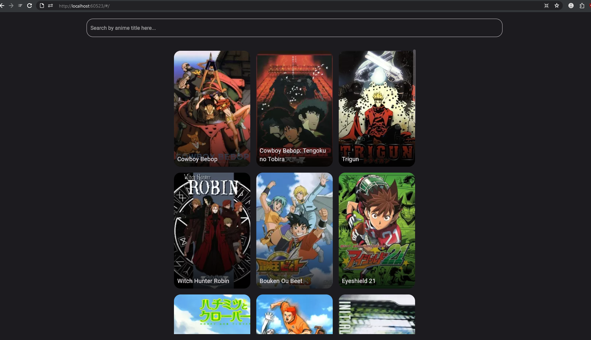
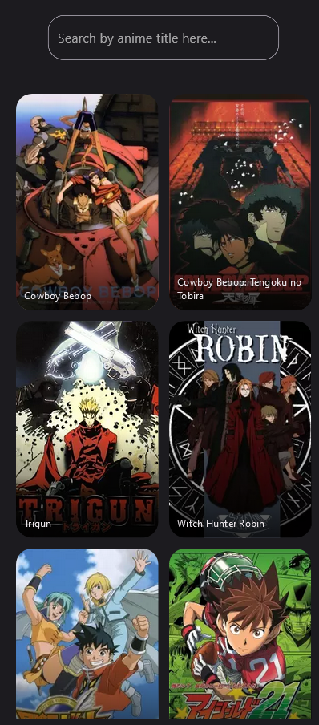
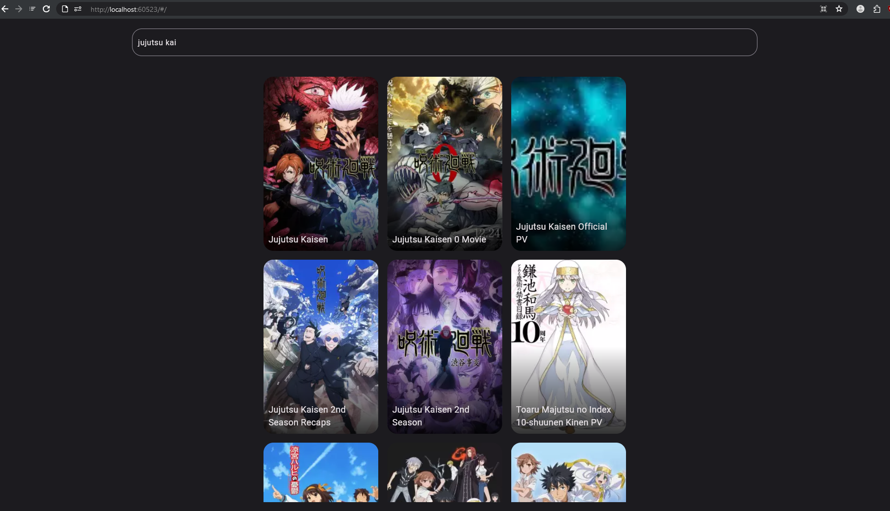
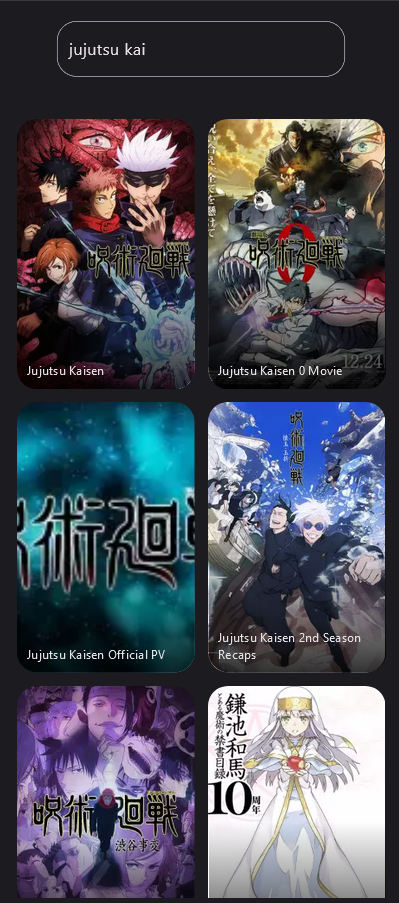
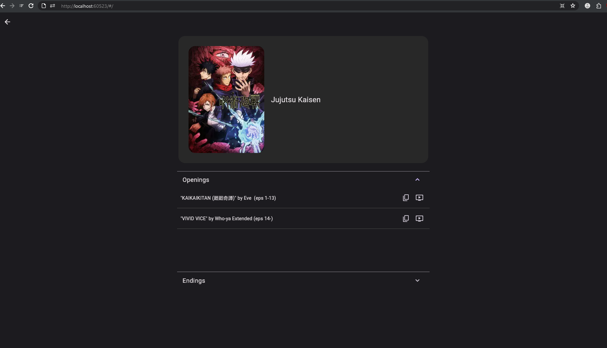
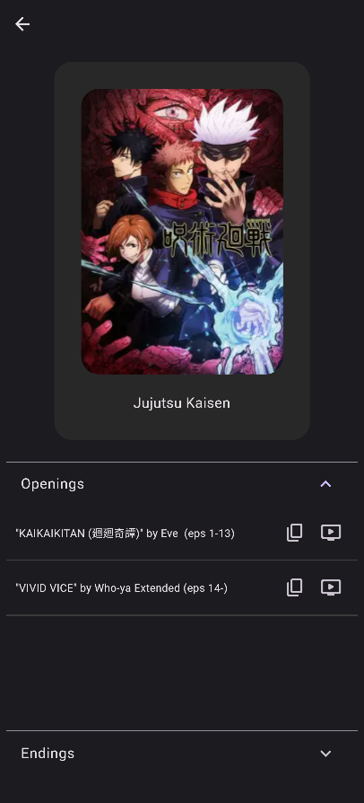

# Anisong

***The API used is not maintained by me and may cause issues.***

An app to get what the opening and ending songs are of an anime title.

*Built and tested only on a dekstop web browser using Gecko-engine.*

## Tech Stack
- Flutter 3.10.6
- Material App
- Flutter packages (check [pubspec.yaml](https://github.com/RadXGH/anisong/blob/main/pubspec.yaml)) : [http](https://pub.dev/packages/http) and [url_launcher](https://pub.dev/packages/url_launcher)
- [Jikan](https://jikan.moe/) API

## App Preview
| Dekstop Web | Mobile Web | Behavior |
|-|-|-|
|  |  | <ul><li>Loads a list of anime from  MyAnimeList.</li><li>Japanese title will be primarly used.</li><li>Also show English title if it exists.</li></ul>  |
|  |  | <ul><li>Search using the title of an anime.</li></ul> |
|  |  | <ul><li>Shows Japanese and English title if available.</li><li>Copy title to clipboard.</li><li>Opens YouTube to search the title.</li></ul>
